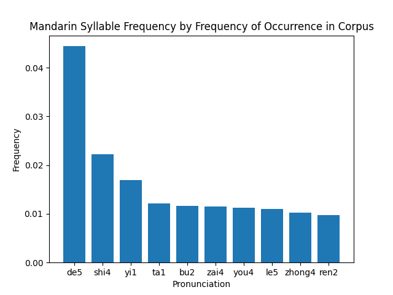
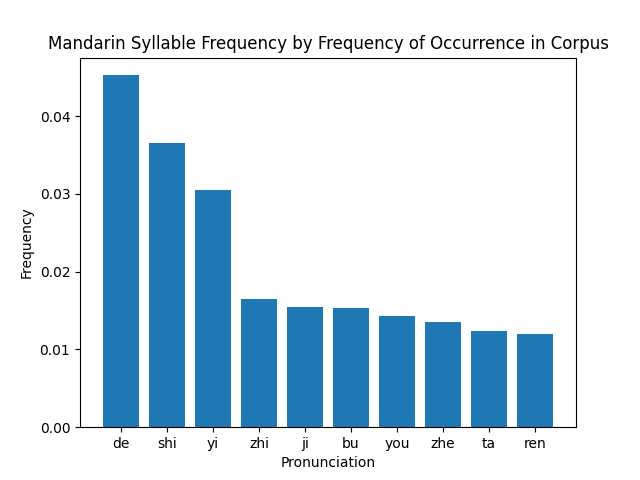

# Mandarin Syllable Frequency

## Motivation

This project was done because there appeared to be a lack of information about a sorted list
of syllable frequencies in Mandarin. While some had overall frequencies, they uniformly weighted
characters and did not use the frequency of occurrence. The data source for this project included
counts but did not include frequencies.

## Results

Including tone, the top syllables were:

Excluding tone, the top syllables were:

## Comments

Interestingly enough, the possessive particle 的 is basically entirely responsible for de5/de
taking top spot in the frequency rankings.

Additionally, through data compiled by reddit user u/LeChatParle
([with tones](https://www.reddit.com/r/ChineseLanguage/comments/ofh5zi/homophone_density_of_top_20_syllables_in_mandarin/),
[without tones](https://www.reddit.com/r/ChineseLanguage/comments/nbfa39/the_most_and_least_dense_syllables_in_mandarin_in/)),
we see that the syllable frequencies vary considerable when we weight them by corpus occurrence as
opposed to character occurrence.

## How to Use

If you are curious to explore this data more thoroughly, you can modify the LIMIT constant,
which determines how many syllables to display. Beyond that,
[this link](https://lingua.mtsu.edu/chinese-computing/statistics/char/list.php?Which=MO), also from
Jun Da's Website, contains frequency data for characters, such that you could look
at what characters contribute to the high frequency syllables.

## Credits

Used data from [Jun Da's Website](https://lingua.mtsu.edu/chinese-computing/phonology/)
but compiled it into a sorted frequency list.